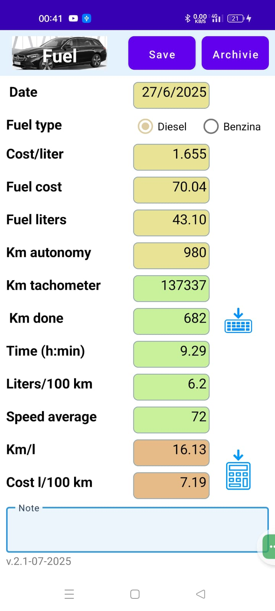

# Fuel Tracker Android App

This Android app allows users to manage and track vehicle fuel refueling — including data entry, storage, calculations, and CSV export for analysis.
Features
- Add refueling data (fuel type, km driven, cost per liter, total cost, etc.)
- Store records locally using SQLite
- View archived entries using Spinner and tabular layout
- Automatic calculation of cost per km and fuel efficiency (km/l)
- Export to CSV with Excel-compatible formatting 🇮🇹
- Clean and responsive UI optimized for daily use

CSV Export
CSV export uses the `;` delimiter for full compatibility with Excel (Italian locale).  
Files include headers and are named with readable timestamps:  
`fuel_export_17_07_2025-10_23.csv`

Technologies
- Java & XML (Android SDK)
- SQLite database
- GitHub (for source control and collaboration)

Installation
1. Clone this repository
2. Open the project in Android Studio
3. Run it on an emulator or Android device

Contributions
Pull requests, suggestions, and ideas are welcome!

License
Licensed under the [MIT](LICENSE) license.

